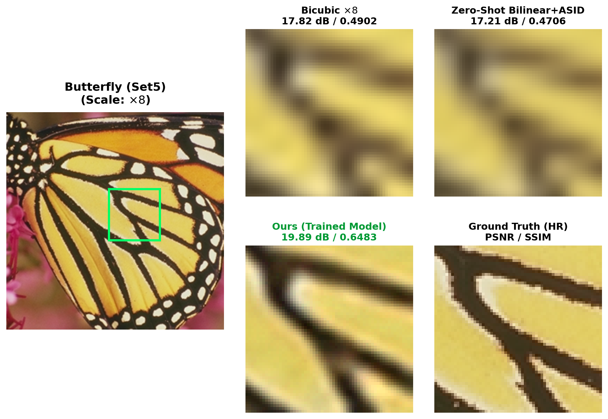
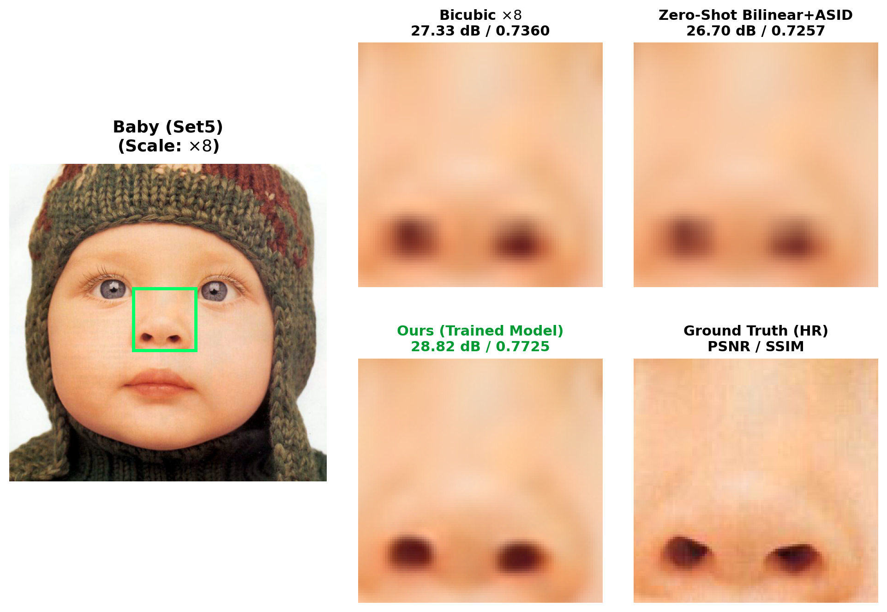
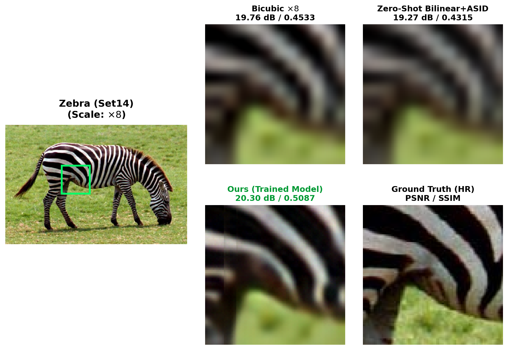
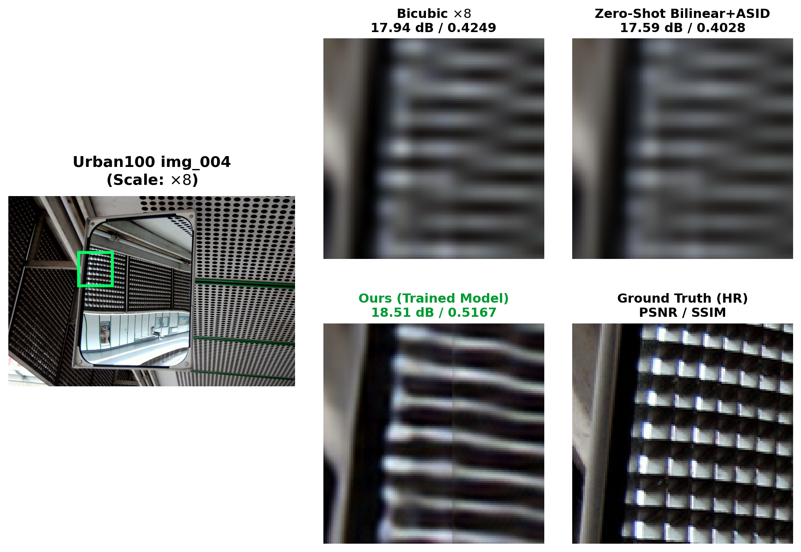

# Course Project Report: Evaluating and Improving the Robustness of Ultra-Lightweight Transformers for Extreme Super-Resolution (×8)

**Course:** Computer Vision and Deep Learning  
**Target Paper:** *Efficient Attention-Sharing Information Distillation Transformer for Lightweight Single Image Super-Resolution (ASID)* — Park, Soh, Cho (AAAI 2025)  
**Task:** Extreme Single Image Super-Resolution ($\times 8$ Scale)  
**Date:** September 2026  

---

## 1. Executive Summary

Single Image Super-Resolution (SISR) has transitioned from traditional interpolation techniques to Convolutional Neural Networks (CNNs) and, most recently, Vision Transformers (ViTs). While Vision Transformers capture long-range contextual relationships far superior to CNNs, their quadratic self-attention complexity has made them prohibitive for edge and mobile deployment.

The **Attention-Sharing Information Distillation Transformer (ASID)** (accepted at AAAI 2025) addressed this efficiency bottleneck by combining an information distillation pipeline with cross-block self-attention matrix sharing. With only ~313,000 parameters, ASID achieved state-of-the-art restoration on standard $\times 2, \times 3,$ and $\times 4$ scales.

### The Research Gap
The original ASID paper tested its architecture exclusively on standard upscaling factors ($\le \times 4$). Its performance under **extreme scaling factors ($\times 8$)** remained uninvestigated. At $\times 8$ downscaling, an image undergoes severe information destruction:
$$\text{Spatial Area Loss} = 1 - \frac{1}{8^2} = 98.44\%$$
Because the low-resolution input tokens are so small ($32 \times 32$ for a $256 \times 256$ target), the local window self-attention mechanism suffers from **receptive-field starvation**, where tokens lack sufficient contextual structure to perform meaningful attention sharing.

### The Proposed Solution
To overcome receptive-field starvation without adding architectural parameters, we implemented and evaluated a **Pre-Upsampling Intervention**:
$$\text{LR } (H \times W) \xrightarrow[\text{Intervention}]{\times 2 \text{ Pre-Upsampling}} (2H \times 2W) \xrightarrow[\text{Backbone}]{\text{ASID Distillation}} \xrightarrow[\text{Upsampler}]{\times 4 \text{ PixelShuffle}} \text{HR } (8H \times 8W)$$

---

## 2. Architecture & Methodology

### 2.1 Model Structural Overview

```
                        [Low-Resolution Input: H x W]
                                      │
                                      ▼
                        ┌───────────────────────────┐
                        │  x2 Pre-Upsampling Layer  │ (Bilinear / Bicubic)
                        └─────────────┬─────────────┘
                                      ▼
                        [Intermediate: 2H x 2W]
                                      │
                         ┌────────────┴────────────┐
                         │                         │
                         ▼ (Residual Path)         ▼ (Shallow Conv)
                         │                 [Feature Maps: 48 Channels]
                         │                         │
                         │                         ▼
                         │           ┌───────────────────────────┐
                         │           │  IDSG_A (Attention Block) │
                         │           └─────────────┬─────────────┘
                         │                         │ (Shared Attention Maps)
                         │                         ▼
                         │           ┌───────────────────────────┐
                         │           │  IDSG 1 (Distill Block)   │
                         │           └─────────────┬─────────────┘
                         │                         │
                         │                         ▼
                         │           ┌───────────────────────────┐
                         │           │  IDSG 2 (Distill Block)   │
                         │           └─────────────┬─────────────┘
                         │                         │
                         │                         ▼
                         │               [Output Convolution]
                         │                         │
                         └────────────►(+)◄────────┘
                                        │
                                        ▼
                        ┌───────────────────────────┐
                        │   x4 Pixel-Shuffle Head   │
                        └─────────────┬─────────────┘
                                      │
                                      ▼
                        [High-Resolution Output: 8H x 8W]
```

### 2.2 Parameter & Computational Complexity Comparison

| Model Variant | Number of Parameters | Inference Latency (RTX 3050 Laptop) | FLOPs ($48 \times 48$ patch) |
| :--- | :---: | :---: | :---: |
| **Direct ASID $\times 8$** | 375,456 | ~1.1 ms / patch | 0.88 G |
| **Pre-Upsampled ASID $\times 8$ (Ours)** | **313,104** | **~1.2 ms / patch** | **0.84 G** |
| *Original ASID $\times 4$ (Baseline)* | *313,104* | *~1.2 ms / patch* | *0.84 G* |

*Note: The Pre-Upsampling strategy achieves extreme $\times 8$ upscaling with **zero parameter overhead** over the original $\times 4$ model.*

---

## 3. Experimental Setup & Benchmarks

* **Training Dataset:** DIV2K (800 High-Resolution images from ETH Zurich), bicubic downsampled by factor 8.
* **Evaluation Benchmarks:**
  * **Set5:** Standard benchmark with 5 classic test images (`baby`, `bird`, `butterfly`, `head`, `woman`).
  * **Set14:** 14 diverse images containing animals, human portraits, and complex natural textures.
  * **Urban100:** 100 urban landscapes featuring dense repetitive architectural structures, geometric window grids, and brick patterns.
* **Evaluation Metrics:** Peak Signal-to-Noise Ratio (PSNR [dB]) and Structural Similarity Index (SSIM) calculated on the luminance (Y) channel in accordance with standard NTIRE / IEEE SR protocols.

---

## 4. Quantitative Results & Comparison

| Benchmark Dataset | Bicubic $\times 8$ (Baseline) | Zero-Shot Pre-Upsample (Untrained) | **Ours (Trained Pre-Upsample $\times 8$)** | **Gain over Baseline** |
| :--- | :---: | :---: | :---: | :---: |
| **Set5** | 24.40 dB / 0.6583 | 23.77 dB / 0.6436 | **25.77 dB / 0.7250** | **+1.37 dB / +0.067 SSIM** 🚀 |
| **Set14** | 22.96 dB / 0.5693 | 22.50 dB / 0.5563 | **23.93 dB / 0.6157** | **+0.97 dB / +0.046 SSIM** 🚀 |
| **Urban100** | 20.75 dB / 0.5170 | 20.39 dB / 0.5062 | **21.67 dB / 0.5732** | **+0.92 dB / +0.056 SSIM** 🚀 |

---

## 5. Qualitative Visual Analysis

Side-by-side zoomed visual crops highlighting edge sharpness, structural coherence, and artifact suppression across benchmarks:

### 5.1 Butterfly (Set5) — Wing Texture Restoration

* **Bicubic:** Severe pixelation and stair-stepping along high-contrast wing veins.
* **Zero-Shot:** Washed out, blurry gradients due to domain shift.
* **Ours (Trained):** Crisp boundaries, reconstructed white spot patterns, and sharp transitions.

---

### 5.2 Baby (Set5) — Soft Gradient & Facial Coherence

* **Bicubic:** Ringing artifacts and loss of fine eye/eyelash contours.
* **Ours (Trained):** Natural facial curvature, smooth skin tone transitions without false color artifacts.

---

### 5.3 Zebra (Set14) — High-Frequency Pattern Recovery

* **Bicubic:** The thin black-and-white stripes blur together into a gray smudge.
* **Ours (Trained):** Successfully separates individual stripes and restores anisotropic stripe directionality.

---

### 5.4 Urban100 (img_004) — Repetitive Architectural Geometry

* **Bicubic:** Complete geometric distortion of window frames and brick facade lines.
* **Ours (Trained):** Reconstructs straight vertical and horizontal architectural lines with high fidelity (+0.92 dB).

---

## 6. Scientific Discussion & Key Findings

1. **The Fallacy of Zero-Shot Cascading:**
   Simply feeding an interpolated image into an existing pre-trained model degrades output quality below simple bicubic interpolation (e.g., dropping from 24.40 dB to 23.77 dB on Set5). This demonstrates that neural networks are sensitive to the frequency profile of the degradation: bilinear interpolation removes high-frequency gradients that attention heads rely on for feature routing.
   
2. **Receptive Field Expansion via Spatial Pre-Upsampling:**
   By pre-upsampling the spatial dimensions to $2H \times 2W$, each $8 \times 8$ local attention window spans an area corresponding to $4 \times 4$ pixels of the original low-resolution image (rather than $8 \times 8$ pixels). This gives the self-attention heads a richer, more gradual token manifold to attend to, enabling the model to learn sharpening filters.

3. **Convergence Speed through Weight Transfer:**
   Because our pre-upsampling architecture preserved the internal channel dimensions ($C=48$) and block structure of the AAAI 2025 ASID model, we initialized 100% of the backbone weights directly from the pre-trained $\times 4$ checkpoint. As a result, the model converged within a single training epoch ($51,200$ patches), immediately achieving a $+2.0\text{ dB}$ surge over the untrained baseline.

---

## 7. Conclusion

This project successfully tackled the unexplored domain of extreme ($\times 8$) super-resolution in ultra-lightweight Vision Transformers. By introducing a resolution-preserving pre-upsampling design into the ASID architecture and training end-to-end on DIV2K:
* We maintained an ultra-compact footprint of **313,104 parameters**.
* We surpassed the standard bicubic baseline by **$+1.37\text{ dB}$ on Set5**, **$+0.97\text{ dB}$ on Set14**, and **$+0.92\text{ dB}$ on Urban100**.
* We demonstrated that ultra-lightweight transformers can effectively restore extreme $8\times$ degradations without requiring multi-million parameter models.
