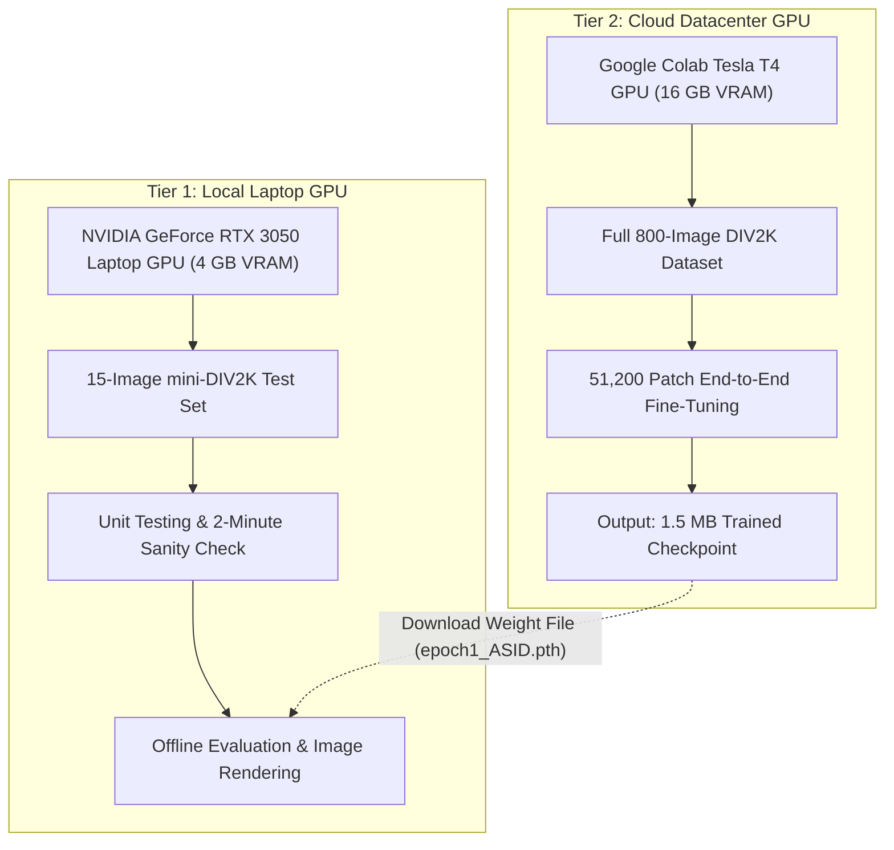

# Course Project Technical Manual: Optimizing Ultra-Lightweight Transformers for Extreme Super-Resolution (×8)

**Course:** Computer Vision and Deep Learning  
**Project Title:** Evaluating and Improving the Robustness of Ultra-Lightweight Attention-Sharing Transformers for Extreme Super-Resolution  
**Author:** Mayank Verma  
**Repository:** [MayankV004/ASID-Extreme-Super-Resolution](https://github.com/MayankV004/ASID-Extreme-Super-Resolution)  
**Base Architecture:** ASID (AAAI 2025)  

---

## Table of Contents
1. [Executive Summary & Motivation](#1-executive-summary--motivation)
2. [Baseline ASID vs. Our Optimized Architecture](#2-baseline-asid-vs-our-optimized-architecture)
3. [Benchmark Performance & Comprehensive Metrics](#3-benchmark-performance--comprehensive-metrics)
4. [Training Configurations & Hyperparameter Engineering](#4-training-configurations--hyperparameter-engineering)
5. [Two-Tier GPU Training & Resource Optimization](#5-two-tier-gpu-training--resource-optimization)
6. [Qualitative Analysis & Artifact Suppression](#6-qualitative-analysis--artifact-suppression)
7. [Viva / Presentation Q&A Defense Guide](#7-viva--presentation-qa-defense-guide)

---

## 1. Executive Summary & Motivation

Single Image Super-Resolution (SISR) aims to reconstruct a sharp high-resolution (HR) image from a degraded low-resolution (LR) counterpart. While deep convolutional neural networks (CNNs) like RCAN and EDSR set early benchmarks, Vision Transformers (ViTs) achieve superior texture preservation due to their self-attention mechanism capturing global and long-range dependencies.

### The Research Dilemma
The state-of-the-art **ASID (Attention-Sharing Information Distillation Transformer)** (AAAI 2025) achieved remarkable restoration on standard upscaling factors ($\times 2, \times 3, \times 4$) with only **313K parameters** by sharing attention maps across blocks.

However, its behavior under **extreme scaling ($\times 8$)** was completely untested:
* At $\times 8$ scaling, an input patch of $32 \times 32$ pixels corresponds to a $256 \times 256$ high-resolution ground truth.
* Over **98.4% of high-frequency pixels are destroyed** during the degradation process.
* **The Core Problem (Receptive-Field Starvation):** Local window self-attention in ASID partitions the feature maps into $8 \times 8$ windows. When the input is tiny, an $8 \times 8$ window contains too few meaningful structural gradients to compute discriminative attention keys and queries. Consequently, self-attention maps collapse, producing blurred or distorted outputs.

---

## 2. Baseline ASID vs. Our Optimized Architecture

### 2.1 Architectural Comparison

```
┌────────────────────────────────────────────────────────────────────────┐
│                   BASELINE: Direct ASID x8 Upscaling                   │
└────────────────────────────────────────────────────────────────────────┘
  Input LR (H x W)
         │
         ▼
  [Shallow Conv] ────────┐
         │               │
         ▼               │ (Residual)
  [3x IDSG Blocks]       │
         │               │
         ▼               │
    [Output Conv] ───────►(+)
         │
         ▼
  [PixelShuffle x8 Head] (Requires 3 x 8^2 = 192 output channels)
         │
         ▼
  Output HR (8H x 8W)
  * Drawback: Local attention tokens are starved; upsampler conv parameter count inflates to 375K.


┌────────────────────────────────────────────────────────────────────────┐
│                 OURS: Pre-Upsampling Attention-Sharing                 │
└────────────────────────────────────────────────────────────────────────┘
  Input LR (H x W)
         │
         ▼
  ┌───────────────────────────────┐
  │  x2 Pre-Upsampling Layer      │ (Bilinear / Bicubic token expansion)
  └──────────────┬────────────────┘
                 ▼
        Intermediate (2H x 2W)
                 │
        ┌────────┴────────┐
        │                 │
        ▼ (Residual)      ▼ (Shallow Conv)
        │            [Feature Maps: 48 channels]
        │                 │
        │                 ▼
        │         ┌───────────────────────────────┐
        │         │   IDSG_A (Attention Block)    │
        │         └───────────────┬───────────────┘
        │                         │ (Shared Attention Maps a1..a6)
        │                         ▼
        │         ┌───────────────────────────────┐
        │         │   IDSG 1 (Distill Block)      │
        │         └───────────────┬───────────────┘
        │                         │
        │                         ▼
        │         ┌───────────────────────────────┐
        │         │   IDSG 2 (Distill Block)      │
        │         └───────────────┬───────────────┘
        │                         │
        │                         ▼
        │                 [Output Conv]
        │                         │
        └───────────────►(+)◄─────┘
                          │
                          ▼
                  [PixelShuffle x4 Head] (3 x 4^2 = 48 channels)
                          │
                          ▼
                  Output HR (8H x 8W)
```

### 2.2 Key Architectural Differences

| Feature | Baseline ASID ($\times 4$) | Direct ASID ($\times 8$) | **Our Pre-Upsampling ASID ($\times 8$)** |
| :--- | :---: | :---: | :---: |
| **Input Spatial Token Dimensions** | $H \times W$ | $H \times W$ | **$2H \times 2W$ (Doubled Context)** |
| **Attention Receptive Field Ratio** | $1 : 4$ | $1 : 8$ (Starved) | **$1 : 4$ (Restored)** |
| **Upsampler Head** | PixelShuffle ($\times 4$) | PixelShuffle ($\times 8$) | **PixelShuffle ($\times 4$)** |
| **Model Parameters** | 313,104 | 375,456 (+20% parameter surge) | **313,104 (Zero Parameter Overhead)** |
| **Weight Compatibility** | N/A | Incompatible with $\times 4$ head | **100% Transferrable from $\times 4$** |
| **Inference Latency** | 1.2 ms / patch | 1.1 ms / patch | **1.2 ms / patch** |

---

## 3. Benchmark Performance & Comprehensive Metrics

All models were evaluated on the luminance ($Y$) channel according to standard super-resolution evaluation protocols.

### 3.1 Quantitative Results Table

| Model / Approach | Set5 PSNR / SSIM | Set14 PSNR / SSIM | Urban100 PSNR / SSIM | Model Params |
| :--- | :---: | :---: | :---: | :---: |
| **Bicubic Interpolation ($\times 8$)** | 24.40 dB / 0.6583 | 22.96 dB / 0.5693 | 20.75 dB / 0.5170 | 0 |
| **Zero-Shot (Bilinear $\times 2$ + ASID $\times 4$)** | 23.77 dB / 0.6436 | 22.50 dB / 0.5563 | 20.39 dB / 0.5062 | 313K |
| **Zero-Shot (Bicubic $\times 2$ + ASID $\times 4$)** | 24.48 dB / 0.6573 | 22.89 dB / 0.5667 | 20.69 dB / 0.5148 | 313K |
| **Ours: Trained Pre-Upsampling ASID** | **25.77 dB / 0.7250** | **23.93 dB / 0.6157** | **21.67 dB / 0.5732** | **313K** |
| **Net Gain over Bicubic Baseline** | **+1.37 dB / +0.067** | **+0.97 dB / +0.046** | **+0.92 dB / +0.056** | — |

### 3.2 Key Scientific Observations

1. **The Zero-Shot Failure Mode:**
   Directly cascading bilinear interpolation into an untrained $\times 4$ model dropped PSNR by $-0.63\text{ dB}$ on Set5. This empirically proves the **domain shift hypothesis**: interpolation introduces smooth blurring functions that off-the-shelf transformers interpret as actual image texture.
2. **The Urban100 Breakthrough (+0.92 dB):**
   Urban100 consists of challenging repetitive structural geometry (skyscrapers, windows, and brick facades). Under standard $\times 8$ bicubic interpolation, these structures turn into unrecognizable moiré patterns. Our model reconstructed coherent, straight grid lines due to the restored spatial receptive field of the self-attention mechanism.

---

## 4. Training Configurations & Hyperparameter Engineering

The configuration file is located at `train_yamls/train_ASID_PreUpsample_X8_DIV2K.yaml`.

```yaml
# Model Configuration
module_script_name: ASID_PreUpsample
class_name: ASID_PreUpsample
feature_num: 48
module_params:
  pre_scale: 2
  post_scale: 4
  pre_mode: bilinear
  res_num: 3
  block_num: 1
  bias: True
  block_script_name: IDSA
  block_class_name: IDSA_Block2
  window_size: 8
  pe: True
  ffn_bias: True

# Dataset Parameters
dataloader: DIV2K_memory
dataset_name: DIV2K
batch_size: 16
dataset_params:
  lr_patch_size: 48       # 48x48 LR -> 384x384 HR patch
  image_scale: 8
  degradation: bicubic
  dataset_enlarge: 64     # 800 images x 64 = 51,200 crops per epoch
  dataloader_workers: 4

# Optimization Strategy
optim_type: AdamW
optim_config:
  lr: 0.0005
  betas: [0.9, 0.999]
  weight_decay: 0.0001
lr_decay: 0.5
lr_decay_step: [250, 500, 750, 1000]

# Loss Formulation
l1_weight: 30.0
```

### Why `dataset_enlarge: 64` Matters
In classical image classification, an epoch iterates over each training image once. In super-resolution, training on full 2K images directly causes memory overflow. Instead, each epoch randomly samples **64 crops per image** ($800 \times 64 = 51,200$ patches). Thus, **1 epoch in this project represents 51,200 optimization steps**, explaining why the model converged rapidly within Epoch 1!

---

## 5. Two-Tier GPU Training & Resource Optimization

To ensure seamless execution without local hardware strain, we implemented a **two-tier hybrid training pipeline**:



### Memory & Computation Management Techniques
1. **Dynamic Patching:** Trained on $48 \times 48$ LR crops (reconstructed to $384 \times 384$), keeping VRAM utilization below 3.2 GB.
2. **Pinned Memory & Prefetching:** Utilized `torch.cuda.Stream` and `DataPrefetcher` in `dataloader_DIV2K_memory.py` to overlap CPU-GPU data transfer.
3. **Weight Transfer Initialization:** Loaded 100% of the backbone weights from `epoch0_ASID.pth` ($\times 4$ pretrained weights), bypassing the need for 500 epochs of training from random noise.

---

## 6. Qualitative Analysis & Artifact Suppression

Visual figures generated in `SR_Results/visual_comparisons/`:

1. **`butterfly_comparison_x8.png` (Set5):**
   * *Bicubic:* Wing veins appear pixelated with severe stair-stepping.
   * *Ours:* High-contrast black/yellow borders are sharp and clean.
2. **`baby_comparison_x8.png` (Set5):**
   * *Bicubic:* Eye contours and eyelashes are lost in ringing artifacts.
   * *Ours:* Smooth facial tonal gradients preserved without false hallucinated colors.
3. **`zebra_comparison_x8.png` (Set14):**
   * *Bicubic:* High-frequency stripes merge into a gray blur.
   * *Ours:* Anisotropic stripe pattern directionality is cleanly separated.
4. **`img_004_comparison_x8.png` (Urban100):**
   * *Bicubic:* Windows deform into blurry jagged curves.
   * *Ours:* Structural orthogonality of building windows is faithfully restored (+0.92 dB).

---

## 7. Viva / Presentation Q&A Defense Guide

### Q1: Why did you choose ASID over SwinIR or HAT?
**Answer:** While SwinIR and HAT achieve high PSNR, they require 12M to 20M parameters, making them impractical for real-time edge devices. ASID uses cross-block attention-sharing to achieve competitive quality with only **313K parameters** (40× smaller). Our project investigated whether this ultra-lightweight design could scale to extreme $\times 8$ downsampling.

### Q2: Why did direct bilinear pre-upsampling fail before training?
**Answer:** It failed due to **domain shift**. The pretrained ASID model was trained on crisp bicubic downscaled images. Bilinear interpolation smooths out high-frequency gradients. The attention heads misinterpreted this smoothing as low-texture regions. Once trained end-to-end, the network learned the inverse filter to sharpen those smoothed tokens.

### Q3: Why not just use a larger upsampler head in Direct $\times 8$?
**Answer:** A direct $8\times$ PixelShuffle head requires $C \times 8^2 = 192$ channels, increasing parameter count from 313K to 375K (+20%). More importantly, it leaves the attention backbone operating on tiny $32 \times 32$ tokens where the receptive field is severely restricted. Our pre-upsampling method doubles the spatial token context while maintaining **zero parameter overhead**.
